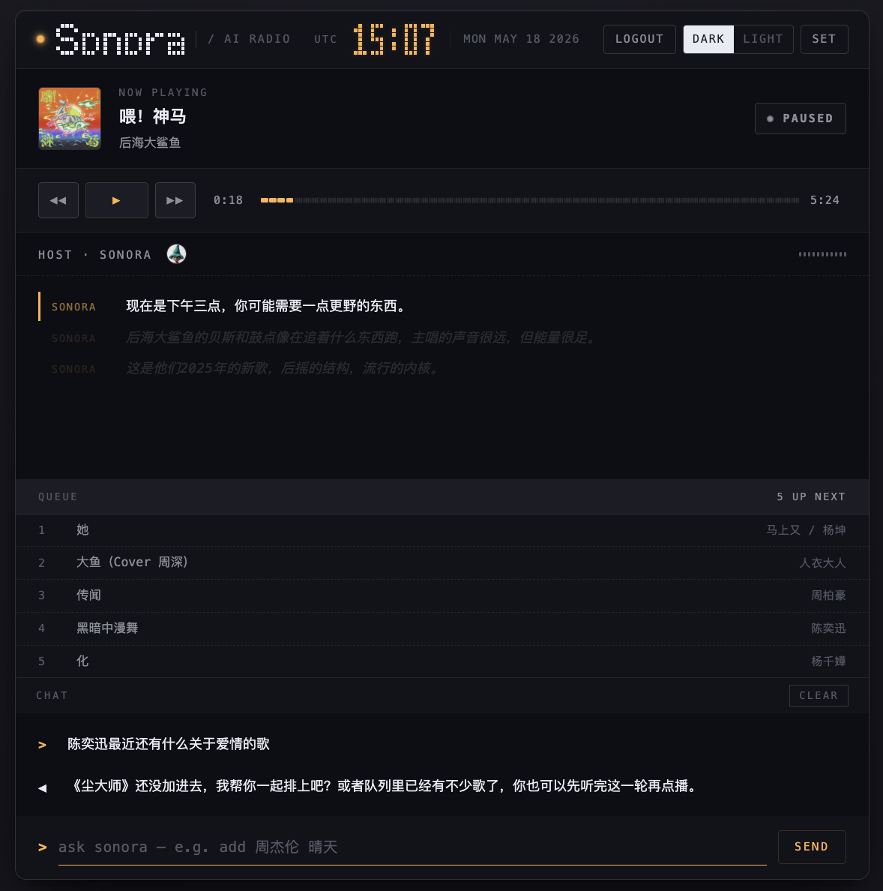

<div align="center">

<h1>
  Sonora
  <br/>
  <sub><sup><sup>AI Radio · Local-first · For your own taste</sup></sup></sub>
</h1>

**你的私人 AI 电台，跑在你自己的电脑上。**
<br/>
读你的网易云歌单，懂你这个点想听什么，找一个 AI DJ 帮你串场。

<p align="center">
  <a href="https://nodejs.org/"></a>
  <a href="https://opensource.org/licenses/MIT"></a>
  <a href="#"></a>
  <a href="#"></a>
  <a href="#"></a>
  <a href="#"></a>
</p>



<sub><i>深色终端美学 · Now Playing / Host / Queue / Chat 四块状态由 WebSocket 实时同步</i></sub>

<br/><br/>

[**快速开始**](#-快速开始) · [**核心特性**](#-核心特性) · [**架构设计**](#-架构设计) · [**API 参考**](#-api-速查) · [**FAQ**](#-faq)

</div>

---

## 💡 Sonora 是什么

Sonora 是一个 **本地优先 (Local-First)** 的私人 AI 电台，旨在打破平台推荐算法的茧房，带来真正懂你的音乐体验。它主要做四件事：

- 🎵 **读你**：拉取你的网易云歌单、喜欢列表、最近播放，沉淀成一份属于你的听歌画像。
- 🧠 **懂此刻**：把时间、天气、心情、最近在听的东西，融合进提示词 (Prompt) 上下文中。
- 🎛️ **挑歌 + 串场**：交给 OpenAI 兼容的大语言模型，智能生成下一个播放队列和个性化主持词。
- 🎙️ **念出来**：通过 StepFun / Fish Audio 合成逼真的主持音频，缓存到本地，与音乐无缝交织。

> *"我不是想要 Spotify 的 AI DJ，我想要一个真的懂我那 5000 首收藏歌的电台。"*

## ✨ 核心特性

| | 传统播放器 | 算法推荐电台 | 🎙️ **Sonora** |
| :--- | :---: | :---: | :---: |
| **🔒 数据归属** | 本地 | 云端 | **纯本地计算，歌单不上传，密钥不外发** |
| **🎯 推荐基础** | 无推荐 | 平台群体行为模型 | **你的专属网易云画像 + 当下情境上下文** |
| **🗣️ 主持人** | 无 | 预录 / 无 | **LLM 实时生成 + 拟真 TTS 合成** |
| **⚙️ 可控性** | 无法修改 | 无法干预 | **修改 `prompts/dj-persona.md` 即时生效** |
| **🚀 部署门槛** | — | 注册即用 | **零配置可跑，填入密钥解锁完整体验** |

---

## 🚀 快速开始

仅需 **Node.js 18+**，无需繁琐的依赖安装：

```bash
git clone <this repo>
cd Sonora
npm install   # 项目无第三方依赖，这一步仅为环境初始化
npm start     # 服务默认运行在 http://localhost:8080
```

**💡 零配置体验**
完全零配置下也能跑！自带内置示例曲库，前端采用浏览器原生 `speechSynthesis` 进行发音。你可以先跑起来感受一下交互，随后在右上角 `SET` 面板中填入密钥，进入完整体验。

---

## ⚙️ 配置外部服务

推荐直接在 Web 设置面板中填写，保存时会自动写入 `.env` 文件并**热加载，无需重启**。你也可以直接创建或修改项目根目录的 `.env` 文件：

```bash
# [必填] OpenAI 兼容模型 (用于智能选歌 + 生成主持词)
OPENAI_BASE_URL=http://localhost:8000/v1
OPENAI_API_KEY=sk-your-key
OPENAI_MODEL=qwen2.5

# [可选] 网易云音乐 API (推荐部署自托管 NeteaseCloudMusicApi)
NCM_BASE_URL=http://localhost:3000

# [可选] TTS 语音合成 (支持 StepFun / Fish Audio)
TTS_URL=https://api.stepfun.com/v1/audio/speech
TTS_API_KEY=your-tts-api-key
TTS_MODEL_ID=stepaudio-2.5-tts
TTS_VOICE_ID=your-default-voice
TTS_EN_MALE_VOICE_ID=your-english-host-voice
TTS_YUE_FEMALE_VOICE_ID=your-cantonese-host-voice
```
> *注：向下兼容旧变量名 `STEP_API_KEY`、`FISH_API_KEY` 等。*

---

## 🏗️ 架构设计

<div align="center">
  
</div>

代码按五层组织，边界清晰且严格：

1. **前端交互层** — PWA 播放器、聊天点歌、设置抽屉、网易云登录二维码。
2. **API 连接层** — REST 接口控制 + `/stream` WebSocket 实时事件推送 + `/api/player/audio` Range 音频代理。
3. **后端编排层** — `server/main.js` 作为**唯一入口**，手工注入(Wire)所有模块，持有队列状态机。
4. **功能模块层** — `router` / `context` / `agent` / `tts` / `taste` / `state` 各管一段，单一职责。
5. **数据与服务层** — 本地 JSON 文件持久化 + 外部服务(NCM / OpenAI / StepFun / Fish)对接。

<details>
<summary><b>🔍 展开查看：核心播放链路</b></summary>

```text
用户打开 / 点歌
  └─ /api/radio/ensure 或 /api/chat
      └─ routeIntent()        意图分流(控制 / 音乐 / 闲聊)
          └─ ContextBuilder   人设 + 画像 + 上下文 + 记忆
              └─ AgentBrain   LLM 选歌 + 主持词(失败 → 本地规则)
                  └─ NCM      取播放链接 / 歌词 / 封面
                      └─ Intro selector  修剪掉空泛话术
                          └─ TtsPipeline 合成主持音频(内容哈希缓存)
                              └─ StateStore  写入 state.db
                                  └─ WebSocketHub  推送到前端
```
</details>

---

## 📂 数据落在哪里

运行时会在项目根目录生成本地数据，**默认不提交**（已在 `.gitignore` 中排除）。

| 路径 | 作用说明 |
| :--- | :--- |
| `.env` | OpenAI、TTS、NCM 等敏感密钥配置 |
| `state.db` | 当前播放、队列、历史、偏好、计划的 JSON 持久化存储 |
| `cache/tts/*.mp3` | 主持人播报音频（按内容哈希命名，可复用，减少费用消耗） |
| `user/ncm-session.json` | 网易云登录会话态 |
| `user/active-user.json` | 当前激活的网易云用户标识 |
| `user/users/<uid>/` | 该用户特有的画像、歌单、喜欢列表、品味统计等专属数据 |

---

## ✨ Features

只记录会改变 Sonora 使用方式或核心能力的重大更新，小修复和样式调整不在这里展开。

| 版本 | 重大功能 | 说明 |
| :--- | :--- | :--- |
| `v0.5` (`2026.05.18`) | **Chat Agent** | `/api/chat` 升级为带工具调用的聊天代理，可由 LLM 决定搜歌、改队列、跳转、刷新画像，并返回带上下文的自然语言回复。 |
| `v0.3` (`2026.05.02`) | **Web 设置面板** | 支持在浏览器里配置 OpenAI、TTS、NCM，并写回 `.env` 热加载；同步补齐项目架构图。 |
| `v0.2` (`2026.05.01`) | **主持混音播放** | 支持主持开场与音乐重叠播放，增强音频代理，并增加多语种主持声音配置。 |
| `v0.1` (`2026.04.29`) | **基础电台链路** | 跑通“队列生成 + 主持播报 + 播放进度控制 + WebSocket 同步”的主干体验。 |

---

## ❓ FAQ

<details>
<summary><b>1. 必须要有网易云账号吗？</b></summary>
不必须。如果不配置 <code>NCM_BASE_URL</code>，系统会使用内置示例曲库运行。但强烈建议配置账号，结合真实听歌画像后体验会有质的飞跃。
</details>

<details>
<summary><b>2. 支持其他的 LLM 大模型厂商吗？</b></summary>
完全支持！只要其 API 兼容 OpenAI Chat Completions 协议即可。不管是本地部署的 vLLM / Ollama 模型，还是云端部署的 DeepSeek / 豆包 / 智谱，修改 base url 和 key 都能轻松接入。
</details>

<details>
<summary><b>3. 可以不使用云端 TTS 吗？</b></summary>
可以。如果不配置 TTS，前端会自动切换至浏览器原生 <code>speechSynthesis</code>，主持人依然会朗读开场白，只是声音会变为系统默认语音。
</details>

<details>
<summary><b>4. 数据放在本地安全吗？</b></summary>
绝对安全，因为所有数据（包含 <code>.env</code> 密钥、登录态、网易云画像、听歌记录）全都在你自己的本机上。API 接口在返回密钥信息时，**严格只返回尾号**，杜绝页面泄漏完整 Key。
</details>

<details>
<summary><b>5. 性能要求高吗？能跑在树莓派 / NAS 上吗？</b></summary>
极佳！由于后端代码采取零依赖策略且没有沉重的构建产物，内存和 CPU 占用极低。只要环境支持 Node.js 18+ 均可流畅运行。且 TTS 具备缓存命中机制，日常挂机极少重复调用外部服务。
</details>

---

## 🗺️ Roadmap

- [ ] **桌面端打包**：使用 Electron / Tauri 进行封装，支持系统托盘常驻与全局媒体快捷键控制。
- [ ] **生态源扩容**：接入更多流媒体平台 Adapter。
- [ ] **多模态上下文**：真实接入天气 / 日历 / 传感器数据 Adapter，替换目前的占位逻辑。
- [ ] **多用户体系**：优化家庭环境下的多网易云账号丝滑在线切换体验。
- [ ] **移动端打磨**：对手机端响应式布局与触控交互做进一步精修。

欢迎任何形式的 Issue 与 PR 参与建设。如果你 fork 出了一套有趣的新 Adapter，强烈欢迎提交 PR 合并回主线！

<br/>

<div align="center">

**[提交 Issue](https://github.com/edc3000/Sonora/issues) | [发起 Pull Request](https://github.com/edc3000/Sonora/pulls)**

License: **MIT** &nbsp;©&nbsp; Sonora Contributors

<sub>如果 Sonora 为你带来了一段美好的专属听歌时光，请不吝赐予一颗 ⭐ Star。</sub>

</div>
