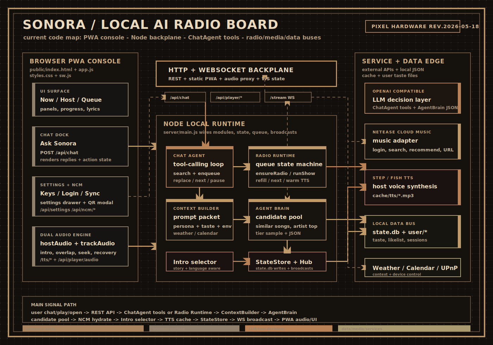

<div align="center">

# Sonora AI Radio

一个本地优先的个人 AI 电台：把网易云歌单、个人偏好、当前上下文和 AI 主持人串成一个可以直接播放的 PWA。

<p>
  <a href="https://nodejs.org/"></a>
  <a href="#接口说明"></a>
  <a href="#项目架构"></a>
</p>

</div>

## 项目现在做什么

Sonora 现在是一套本地 Node.js 服务加浏览器 PWA 的个人电台系统。前端负责播放器、聊天点歌、网易云登录、偏好编辑和运行时设置；后端负责意图分流、上下文组装、推荐选歌、网易云取歌、主持人播报 TTS、状态持久化和 WebSocket 实时同步。

即使没有配置外部服务，项目也能用内置示例歌曲和浏览器语音兜底跑起来；配置网易云、OpenAI 兼容模型和 TTS 后，会进入完整的“歌单画像 + AI 选歌 + 主持人播报”体验。

## 核心能力

- **PWA 播放器**：`public/index.html` 和 `public/app.js` 提供电台主界面、队列、进度、主持稿、设置抽屉和 Service Worker。
- **AI 推荐与主持**：`server/agent.js` 构建候选池，结合用户输入、听歌偏好和最近播放记录生成 `say`、`play[]`、`reason`、`segue`。
- **网易云音乐适配**：`server/adapters/ncm.js` 支持扫码登录、歌单读取、喜欢列表同步、搜索、相似歌曲、歌手热门歌、播放链接和歌词解析。
- **个人品味沉淀**：`server/taste.js` 把网易云喜欢列表归一化成 `likelist.json`、`taste_stats.json` 和 `taste.md`。
- **主持人声音管线**：`server/tts.js` 支持 StepFun / Fish Audio，按歌曲语言选择 voice，并把结果缓存到 `cache/tts/*.mp3`。
- **运行时设置**：`server/config.js` 支持读取和保存 OpenAI、TTS、NCM 配置，前端通过 `GET/POST /api/settings` 写回 `.env`。
- **实时同步**：`server/ws.js` 通过 `/stream` 推送 `now-playing`、`queue-updated`、`host-speaking`、`track-ended` 等事件。

## 项目架构



当前代码可以按五层理解：

1. **前端交互层**：播放器、聊天点歌、设置、网易云账号和歌单同步入口。
2. **API 连接层**：REST API 处理命令和数据，`/stream` WebSocket 处理实时状态推送，`/tts/*` 和 `/api/player/audio` 处理音频。
3. **后端编排层**：`server/main.js` 启动服务、创建核心对象、维护电台队列，并在启动时调用 `ensureRadio()`。
4. **后端功能模块层**：`router.js`、`context.js`、`agent.js`、`adapters/ncm.js`、`tts.js`、`taste.js`、`config.js`、`state.js`、`scheduler.js`。
5. **数据和外部服务层**：`state.db`、`user/*`、`.env`、OpenAI 兼容模型、网易云音乐 API、StepFun / Fish TTS。

核心播放链路：

```text
用户打开或发起点歌
-> /api/radio/ensure 或 /api/chat
-> routeIntent()
-> ContextBuilder.build()
-> AgentBrain.compute()
-> NCM hydrateTrack()
-> TtsPipeline.synthesize()
-> StateStore.update()
-> WebSocketHub.broadcast()
-> 前端播放主持人声音和歌曲音频
```

## 快速开始

### 运行

```bash
npm start
```

服务默认监听：

```text
http://localhost:8080
```

`npm run dev` 目前也会执行同一个入口：`node server/main.js`。

### 配置外部服务

可以直接在 Web 设置面板里填写，也可以创建 `.env`。前端保存设置时会调用 `POST /api/settings`，后端会写回 `.env` 并更新当前运行时配置。

```bash
# OpenAI 兼容模型
OPENAI_BASE_URL=http://localhost:8000/v1
OPENAI_API_KEY=sk-your-key
OPENAI_MODEL=qwen2.5

# 网易云音乐 API
NCM_BASE_URL=http://localhost:3000

# TTS：支持 StepFun / Fish Audio
TTS_URL=https://api.stepfun.com/v1/audio/speech
TTS_API_KEY=your-tts-api-key
TTS_MODEL_ID=stepaudio-2.5-tts
TTS_VOICE_ID=your-default-voice
TTS_EN_MALE_VOICE_ID=your-english-host-voice
TTS_YUE_FEMALE_VOICE_ID=your-cantonese-host-voice
```

兼容旧变量：`STEP_API_KEY`、`STEPFUN_API_KEY`、`STEP_TTS_BASE_URL`、`STEP_TTS_MODEL`、`STEP_TTS_VOICE`、`FISH_API_KEY`、`FISH_BASE_URL`、`FISH_MODEL`、`FISH_VOICE_ID` 等仍会被读取作为兜底。

## 数据文件

运行时会在项目根目录生成本地数据。它们通常不应该提交：

| 路径 | 作用 |
| :--- | :--- |
| `.env` | OpenAI、TTS、NCM 等运行时配置 |
| `state.db` | 当前播放、队列、历史、偏好和计划 |
| `cache/tts/*.mp3` | 主持人播报音频缓存 |
| `user/ncm-session.json` | 网易云登录态 |
| `user/active-user.json` | 当前激活的网易云用户 |
| `user/users/<uid>/` | 用户画像、歌单、喜欢列表和同步状态 |

## 接口说明

| 方法 | 端点 | 说明 |
| :--- | :--- | :--- |
| `GET` | `/api/now` | 获取当前播放状态、队列、主持人播报和进度 |
| `GET` | `/api/taste` | 读取当前用户的 `taste.md`、例程、规则和歌单数据 |
| `POST` | `/api/taste/import` | 保存前端编辑的偏好、例程、规则和歌单 |
| `GET` | `/api/settings` | 读取运行时配置，密钥只返回是否已配置和尾号 |
| `POST` | `/api/settings` | 保存 OpenAI、TTS、NCM 配置并写回 `.env` |
| `GET` | `/api/ncm/status` | 获取网易云配置、登录和同步状态 |
| `POST` | `/api/ncm/login/qr/create` | 创建网易云扫码登录二维码 |
| `GET` | `/api/ncm/login/qr/check` | 轮询二维码登录状态 |
| `POST` | `/api/ncm/sync` | 同步网易云歌单和喜欢列表，生成品味画像 |
| `POST` | `/api/ncm/logout` | 清空网易云登录态并取消激活用户 |
| `GET` | `/api/plan/today` | 获取当天电台计划 |
| `POST` | `/api/radio/ensure` | 确保电台有当前歌曲和队列，不足时补队列 |
| `POST` | `/api/chat` | 用户自然语言请求；控制指令会直接映射到播放器动作 |
| `POST` | `/api/player/play` | 设置播放状态，可同步当前进度 |
| `POST` | `/api/player/pause` | 暂停播放，可同步当前进度 |
| `POST` | `/api/player/seek` | 更新播放进度和状态 |
| `POST` | `/api/player/next` | 切到下一首；队列不足时触发补队列 |
| `POST` | `/api/player/prev` | 切回上一首 |
| `POST` | `/api/player/refresh-audio` | 刷新当前歌曲的播放链接 |
| `GET` | `/api/player/audio?id=...` | 代理当前歌曲音频，支持 Range 请求 |
| `GET` | `/tts/<hash>.mp3` | 读取缓存的主持人 TTS 音频 |
| `WS` | `/stream` | 推送播放状态、队列和主持人事件 |

## 主要目录

```text
public/
  index.html          PWA 页面结构
  app.js              前端播放器、设置、登录、WebSocket 和音频控制
  styles.css          UI 样式
  sw.js               Service Worker

server/
  main.js             服务入口和电台运行编排
  http.js             REST API、静态文件、TTS 文件和音频代理入口
  ws.js               WebSocket 推送
  router.js           用户输入意图分流
  context.js          LLM 上下文组装
  agent.js            候选池、推荐、LLM 调用和兜底逻辑
  tts.js              Step/Fish TTS 和缓存
  taste.js            网易云歌单同步、归一化和品味画像
  config.js           环境变量和运行时设置读写
  state.js            本地状态持久化
  scheduler.js        每日计划和小时级提示
  adapters/           NCM、天气、日历、UPnP 适配器

docs/
  architecture.svg    项目架构图
```

## 当前降级策略

- 没有 `NCM_BASE_URL` 时，音乐适配器会使用内置示例歌曲。
- 没有 OpenAI 配置或模型调用失败时，`AgentBrain` 会用本地规则从候选池中选歌。
- 没有 TTS 配置或 TTS 调用失败时，前端会使用浏览器语音兜底。
- 天气、日历和 UPnP 目前是轻量占位适配器，已经接入上下文和控制链路，后续可以替换成真实服务。

## License

MIT
